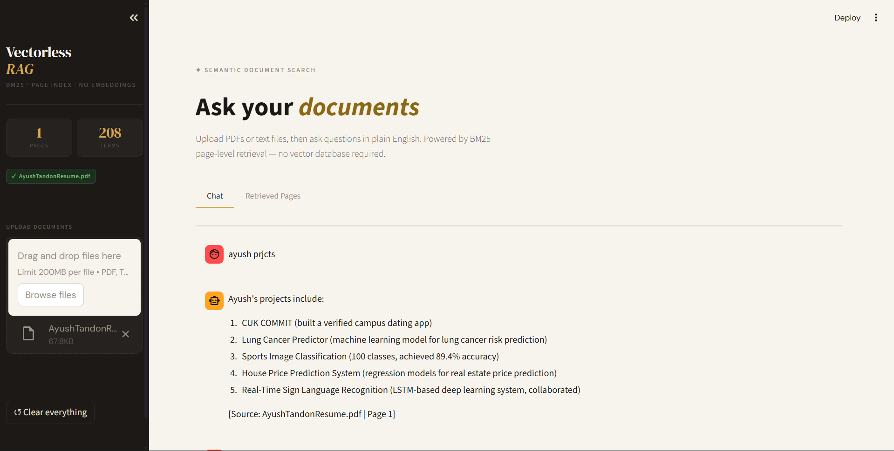

# Vectorless RAG, Semantic Document Search |   **[Try Live Demo](https://droid-devx-vectorlessrag-qa-app-8eprz4.streamlit.app/)**
Real-time pipeline for retrieving and analyzing documents using a Custom BM25 Page-Index retrieval engine in Python — with automated text chunking, TF-IDF ranking, and a high-speed LLaMA generation fallback (Groq).

 


## Results at a Glance
| | Vectorless (BM25) | Vector DB (Embeddings) |
| :--- | :--- | :--- |
| **Approach** | TF-IDF / Local BM25 | Semantic Embeddings |
| **Indexing Speed** | Near Instant | Slower (API Dependency) |
| **Storage Size** | Minimal (In-Memory) | High (Vector Storage) |
| **Robustness** | High (Exact Keywords) | High (Contextual) |
| **Generation** | Groq LLaMA Inference | External API Inference |

### BM25 Page-Index Engine
- **Search Config**: `k1=1.5, b=0.75` 
- **Retrieval Engine**: Custom Inverted Index
- **Preprocessing**: Tokenization, Stopwords Removal, Term Freq.
- **Chunking Strategy**: By Page (`.pdf`) or 2000c Blocks (`.txt`)

### Groq LLaMA Model (Generator)
- **Model Baseline**: `llama-3.3-70b-versatile`
- **Confidence Constraint**: Strict Grounding (answers only using context)
- **Latency Setup**: Very Fast

---

## How It Works
- **Observation (Document Input):** PDF or TXT files uploaded via Streamlit, text extracted and chunked page-by-page.
- **Action/Prediction (Retrieval):** Custom BM25 search engine tokenizes the user query and calculates TF-IDF scores to retrieve the top-4 relevant pages.
- **Key preprocessing components:** Automated page extraction—`rag_engine.py` builds an inverted index over the extracted pages, dropping common stopwords and optimizing search dynamically.
- **Termination/Fallback:** The LLM receives the constructed context and generates a plain-English answer grounded purely in the document, explicitly citing sources. If no context correlates, it refuses the answer to prevent hallucinations.

---

## Setup
```bash
pip install streamlit requests pypdf
```

```text
Vectorless_RAG/
├── app.py               # Streamlit application logic & chat interface
├── rag_engine.py        # Vectorless retrieval, tokenization, & inverted index
└── .streamlit/
    └── config.toml      # Configuration settings for custom UI themes
```

---

## Usage

```bash
# 1. Set your Groq API Key
$env:GROQ_API_KEY="gsk_..."  # Windows PowerShell
export GROQ_API_KEY="gsk_..." # Linux/macOS

# 2. Launch the Streamlit App
streamlit run app.py
```

---

## Key Design Decisions
- **Custom BM25 Engine** — completely vectorless architecture using robust token transformations and inverted index, achieving high-speed term-based extraction without massive dependencies.
- **Strict Grounding criteria** — ensures hallucinations are strictly classified as "not present" for better contextual accuracy.
- **Automated page-level chunking** — `rag_engine.py` parses PDFs methodically maintaining exact page structures, so source citations are flawlessly accurate instead of drifting boundaries.
- **Groq LLaMA Deployment** — provides an immediate, low-latency LPU deployment alternative without requiring heavy cost or local tensors.

---

## License
MIT — see Streamlit and Groq for dependencies.
